# ポートフォリオ

---
## 取り組んでいるプログラミング作品への開発Git
C++とWni32でHit & Blow : [Cpp_WindowGame](https://github.com/ho6ho6/Cpp_WindowGame)  
C++とWin32を使ってミニゲームエンジン : [minigame_engine](https://github.com/ho6ho6/minigame_engine)  
Unityで一人称チェス : [ho66Games_FPSChess](https://github.com/ho6ho6/ho66Games_FPSChess.git)
---
---

# Hit & Blow (C++ / Win32 API)

## 概要
4桁の数字を推理する脳トレゲーム。GUIは Windows API を用いて自作。 
入力欄、決定ボタン、履歴表示などを全て Win32 API で構築。

## 実際の画面

### ゲーム開始画面
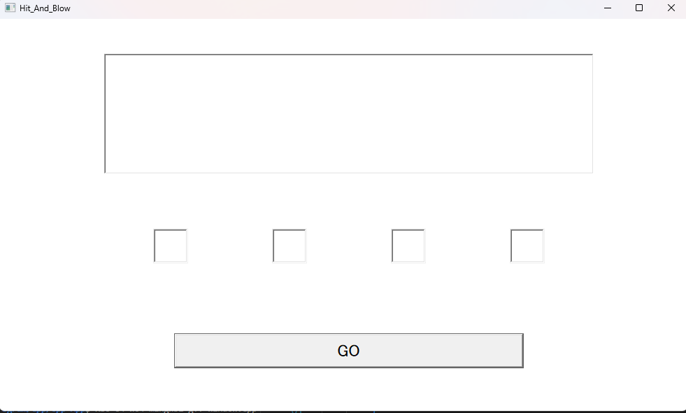

### 数字を入れて値を考察する画面
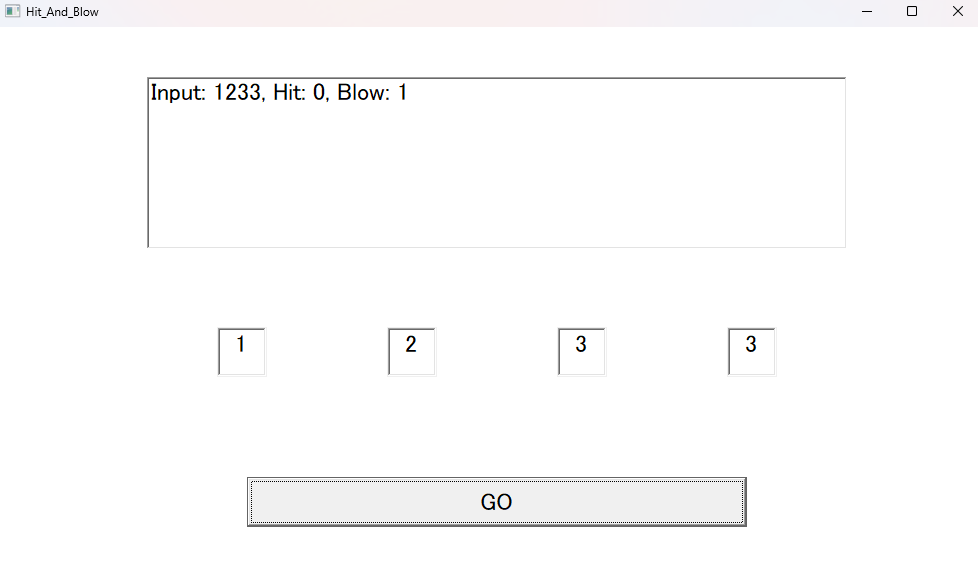

### クリアタイム表示画面
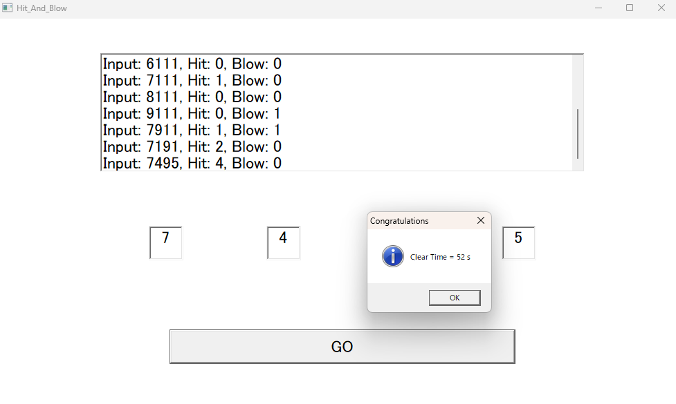

### 入力欄に数字が足りない画面
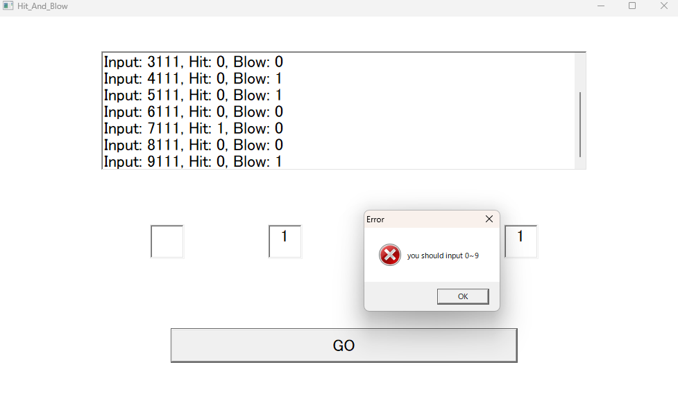

## 技術ポイント
- C++17 + Win32 API による GUI構築（Edit, Button, ListBox）
- 入力制限(ES_SETLIMITTEXT)で1桁のみ、数字以外を拒否し後の処理を簡単に
- ヒット＆ブロー判定アルゴリズム(重複数字対応)
- std::chronoによるプレイ時間計測と表示
- 入力のバリデーションと履歴の動的更新

## 今後の改善案
- 難易度選択を可能
- マウスだけで操作

## 開発GitのURL
[Cpp_WindowGame](https://github.com/ho6ho6/Cpp_WindowGame)

---
---
# ミニゲームエンジン (C++ / Win32 API / DirectX11 / ImGui)

## 概要
UnityやUnreal Engine、Godotのようなゲームエンジンを目標にし、ソースコードを書かないゲームエンジンを作成中。 
予め、オブジェクトには各キーやマウスを設定しておき、ユーザーはチェックを入れどのキーに対応させるかを考えるだけで良いものにする。 
その他パラメータはAdd_Componentから追加し、数値を入力するだけのものにする。 
基本は Win32 API を使い、現状はWindows用に構築。

## 実際の画面

### 現状-読み込んだテクスチャをsceneウィンドウ上に配置し、gameウィンドウ(プレイヤーが見るウィンドウ)にsceneウィンドウの内容を表示する
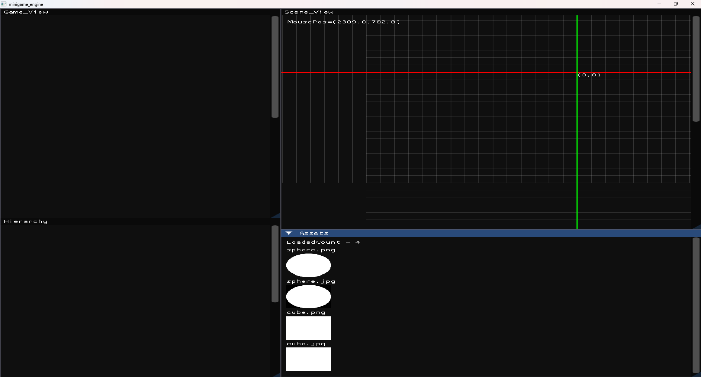

## 今後の予定
- sceneウィンドウ上にオブジェクトを配置させ、gameウィンドウにsceneウィンドウの内容を映す
- ゲームファイルを.exeで出力できるようにする

## 開発Git
[minigame_engine](https://github.com/ho6ho6/minigame_engine)

---
---

# FPS_Chess (Unity)

## 概要
チェスの駒をFPS視点で操作するアクション×戦略ゲーム。   
UnityRoomで公開中。チェスのルールとFPS操作を融合した新感覚ゲーム。

## 実際の画面

### デバック画面
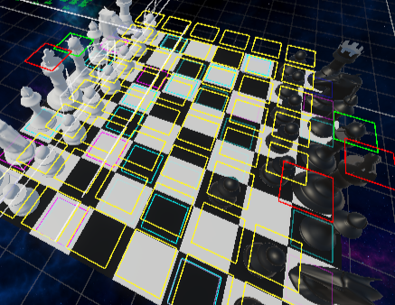

### ルーク視点
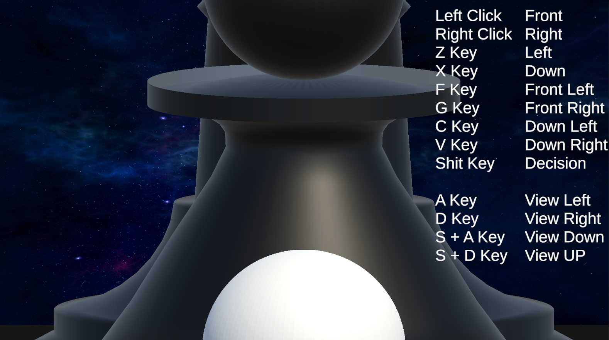

### キング視点
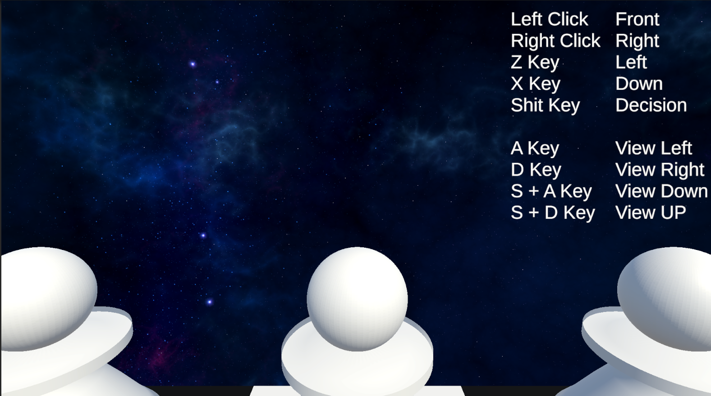

## 技術ポイント
- Unity + C# による3Dゲーム開発
- 駒ごとの移動ロジックと攻撃判定の実装
- プレイヤー視点の切り替えとカメラ制御
- UI表示（ターン管理、勝敗判定）

## 工夫した点
- チェスのルールをベースにした独自のゲーム性
- 駒の種類ごとのスキルや移動制限の設計
- UnityRoomでの公開を想定した軽量化と操作性の調整
- ゲーム全体の雰囲気・プレイヤーの気を散らさない程度のBGMの作成

## 今後の改善案
- マルチプレイ対応（Photonなど）
- 駒のスキル演出強化（エフェクト、SE）
- ターン制のUI改善とチュートリアル追加

## 作成した音源
[🎵 title.mp3 を聴く](./sound/タイトルBGM.mp3)  
[🎵 game.mp3 を聴く](./sound/対戦BGM.mp3)  
[🎵 result.mp3 を聴く](./sound/結果画面.mp3)  

## 開発GitのURL
[ho66Games_FPSChess](https://github.com/ho6ho6/ho66Games_FPSChess.git)

## UnityRoom
[FPS_Chess](https://unityroom.com/games/ho66games_fpschess)

---
---

## 技術スタック
- C
- C++ (Win32 API)
- C#  (Unity, ゲームロジック, UI制御)
- Git / GitHub (ブランチ管理/README整備)
- Python

---
---

# 過去に作成したキャラクタや2D・3Dグラフィックス
## 2Dシューティングゲームに作成したAssets (グラディウスを参考にして作成しました)
1. 星間飛行  
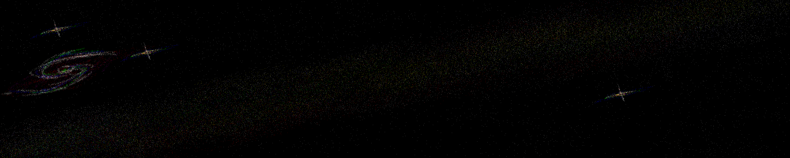
2. 敵の本拠地  
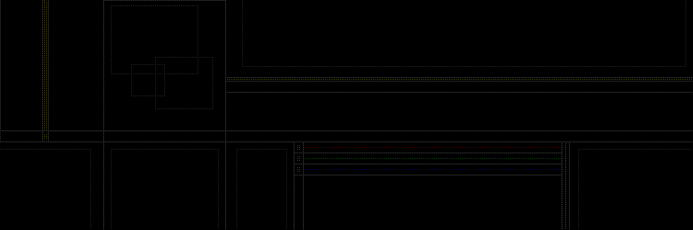

### 自キャラ・敵キャラ   
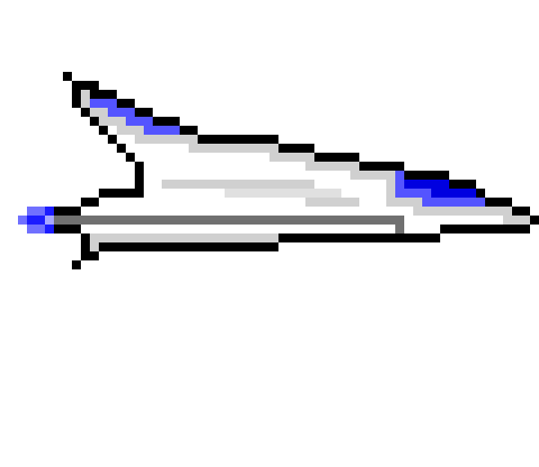
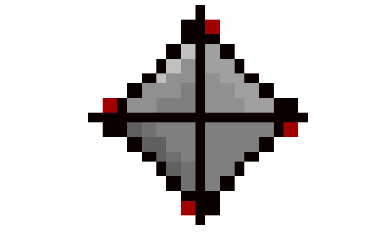

## 3Dグラフィックス (リミナルスペースと呼ばれる空間のモデリングを中心に行っています)  
1. プール空間  

2. 子供部屋  
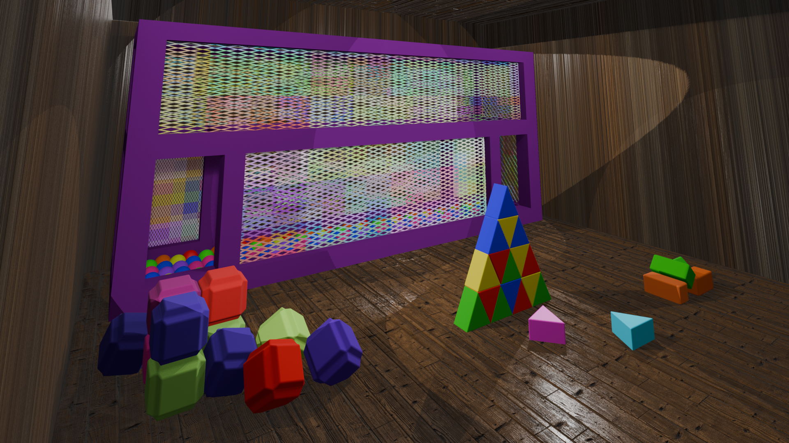
3. 曇り空の夜  
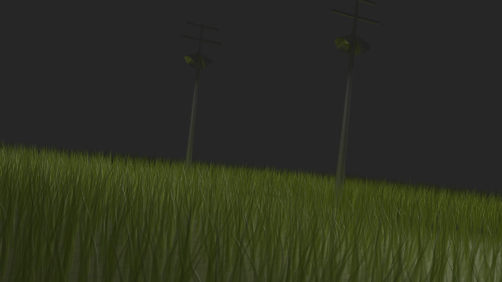

---
---

## その他
- GUIやゲームロジックを構築することが好きです。
- バグの検出・修正や、ユーザー目線の開発に粘り強く取り組むことを意識しています。
- 今後はネットワーク通信やAIを活かしたより躍動的なゲームにも挑戦したいです。
- 新しい着眼点をもってゲーム制作や、プログラミングに取り組むことを心掛けています。

