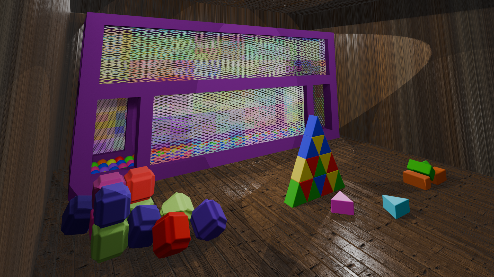
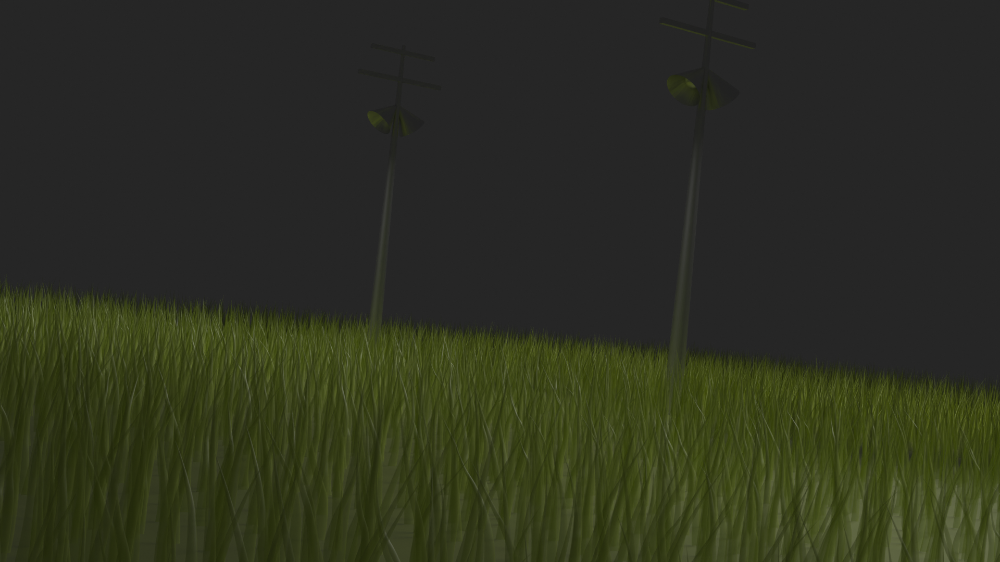
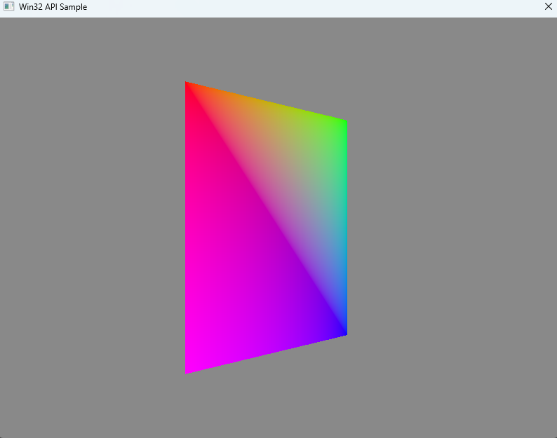
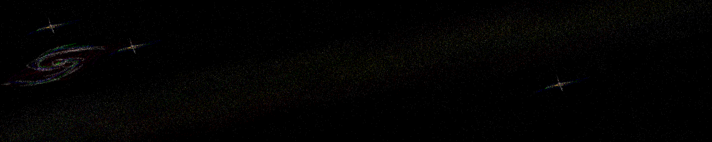
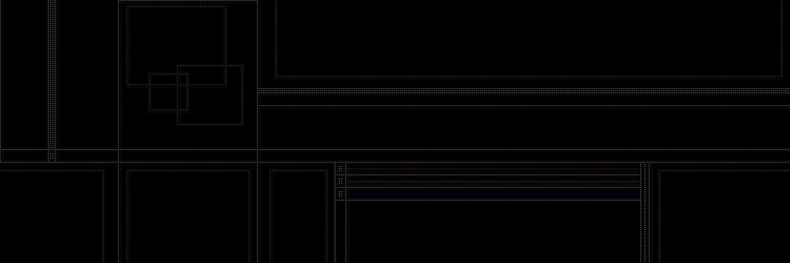
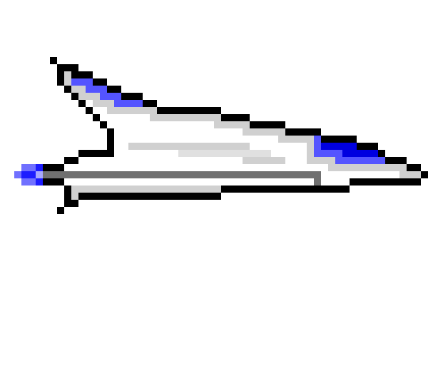
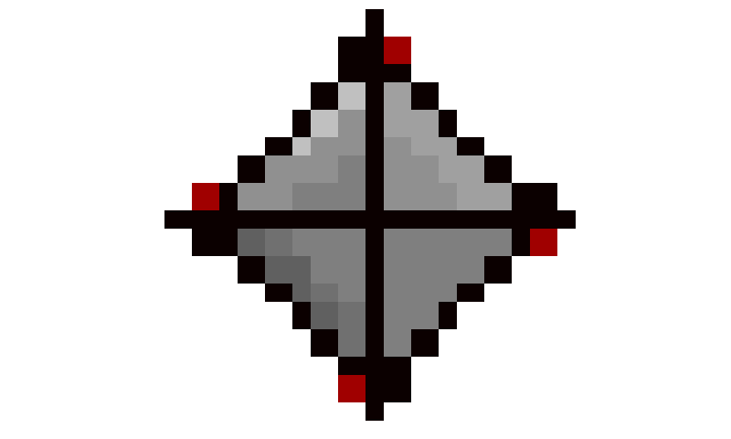

# ポートフォリオ

---
# 現在取り組んでいるプログラミング作品への開発Git

## 個人制作
### C++とWin32を使ってゲームエンジン : [ゲームエンジン](https://github.com/ho6ho6/Re_GameEngine)  

## Unity
### オンラインドッジボール : [ドッジボール](https://github.com/ho6ho6/Dogeball)  

## 共同制作
### 花札ポーカー : [花札ポーカー](https://github.com/ryoncy-git/hanafudaPoker)  

---
---

# ゲームエンジン (C++ / Win32 API / DirectX11 / ImGui)

## 概要

## 実際の画面

## 現状

## 技術的な工夫

## 今後の予定

---
---

# 過去に作成したキャラクタや2D・3Dグラフィックス

## 3Dグラフィックス (リミナルスペースと呼ばれる空間のモデリングを中心に行っています)  
### Blender
1. プール空間  

2. 子供部屋  

3. 曇り空の夜  

### DirectX12 (学習中 2026/3/1~)
・フレーム毎の定数バッファ更新による回転アニメーション実装  
・ルートシグネチャ / PSO の構築  
・コマンドリストによる描画フローの理解  
・CPU-GPU間の同期（フレームインデックス管理）を意識して実装  

※『Direct3D 12 ゲームグラフィックス 実践ガイド』（Pocol著、技術評論社）を参考に実装。処理の流れやGPUリソース管理を意識しながら学習中。  

1. 2つの三角形を用いて、4角形をインデックスバッファを使用して生成  

---
---

## 2Dシューティングゲームに作成したAssets (グラディウスを参考にして作成しました)
1. 星間飛行  

2. 敵の本拠地  

### 自キャラ・敵キャラ   

## その他 大学での考察など
アセンブリ言語に関する個人的な考察 
[assembly](https://github.com/Rikuhonjou/assembly)

---
---

# 終わりに
- GUIやゲームロジックを構築することが好きです。
- バグの検出・修正や、ユーザー目線の開発に粘り強く取り組むことを意識しています。
- 今後はネットワーク通信やAIを活かしたより躍動的なゲームにも挑戦したいです。
- 新しい着眼点をもってゲーム制作や、プログラミングに取り組むことを心掛けています。
- 競技プログラミングではpaizaのスキルチェック問題に取り組んでいます。ランク帯はBで、最高レートは1426です。
